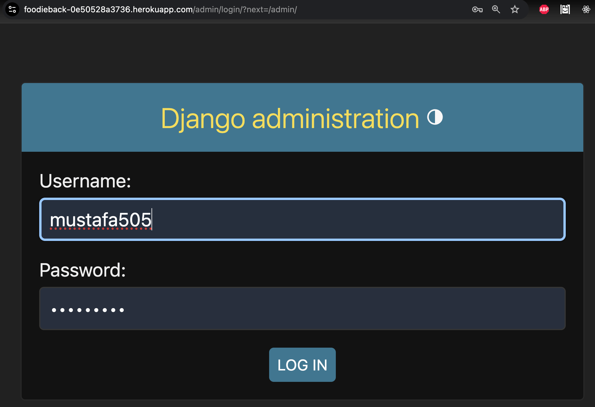
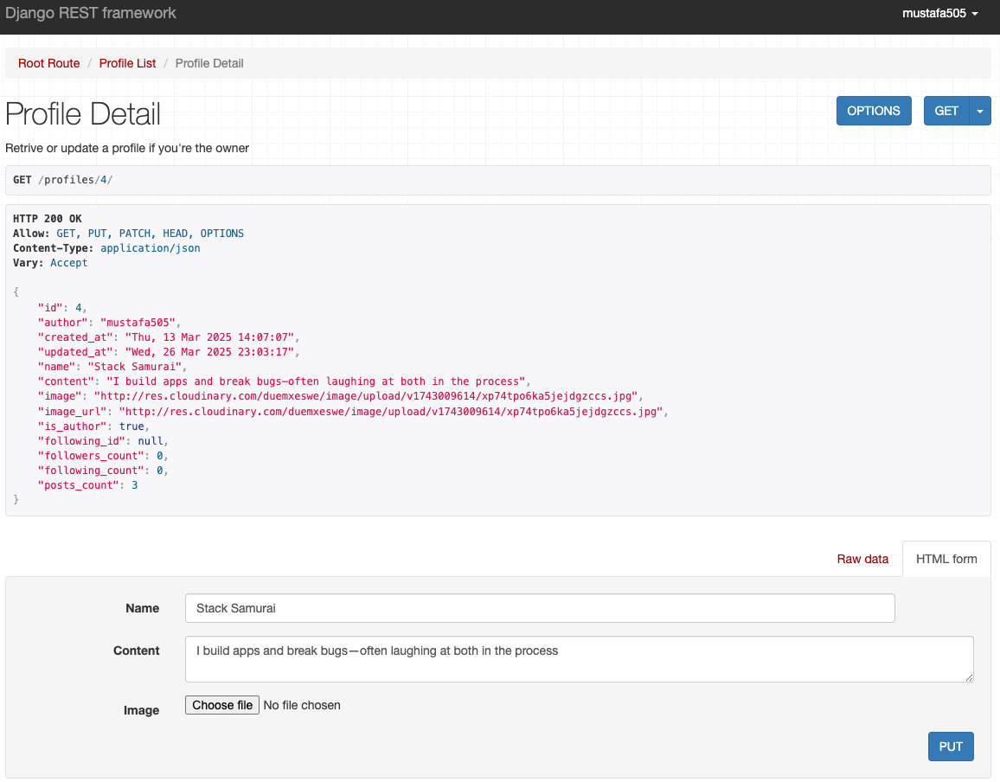
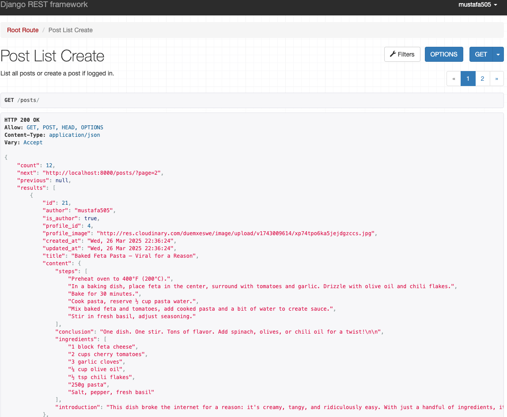
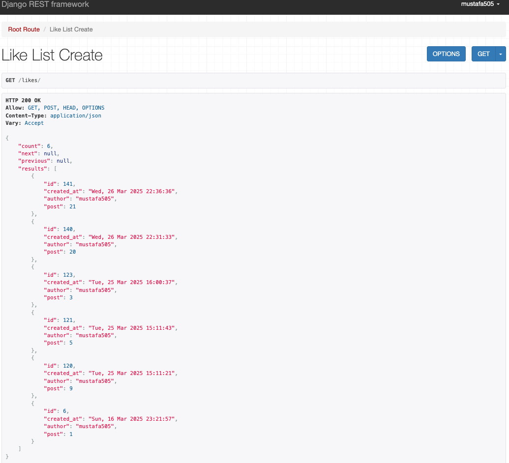
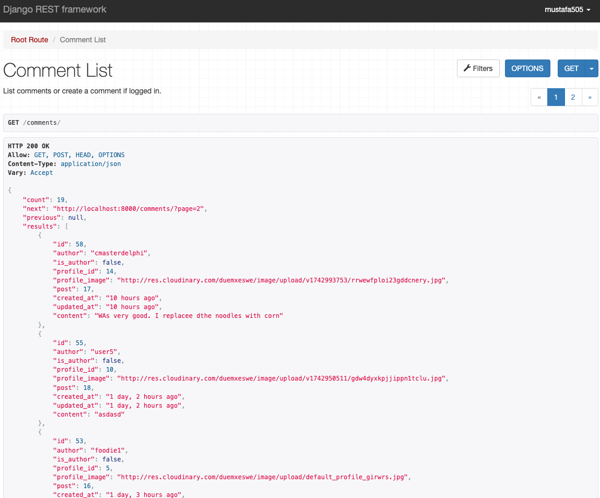
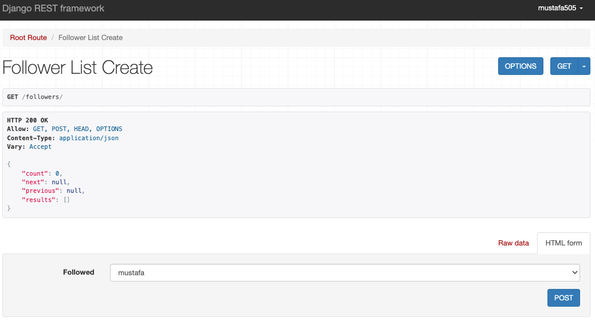
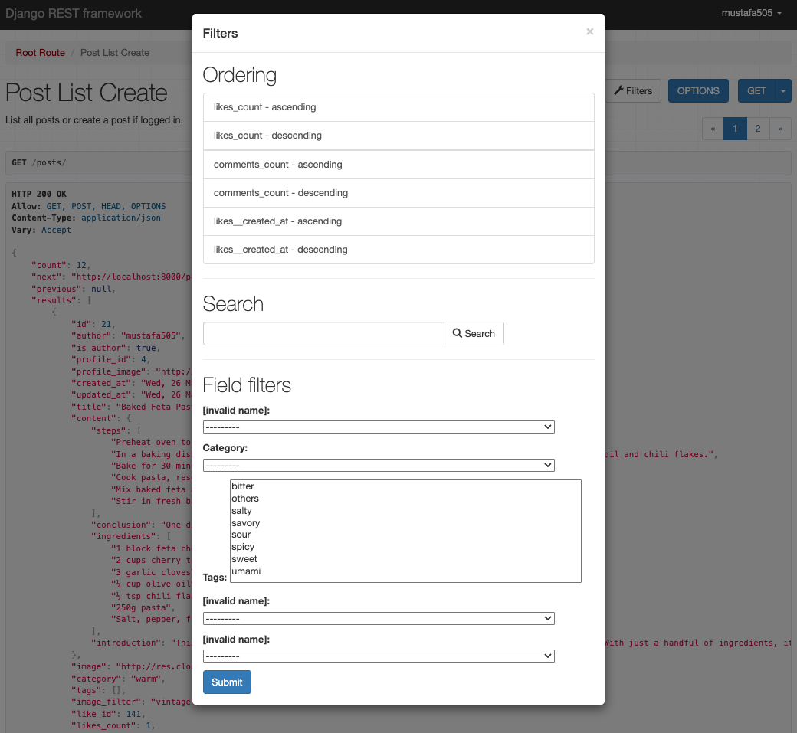
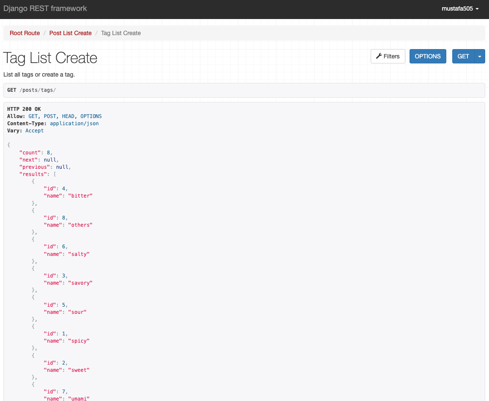
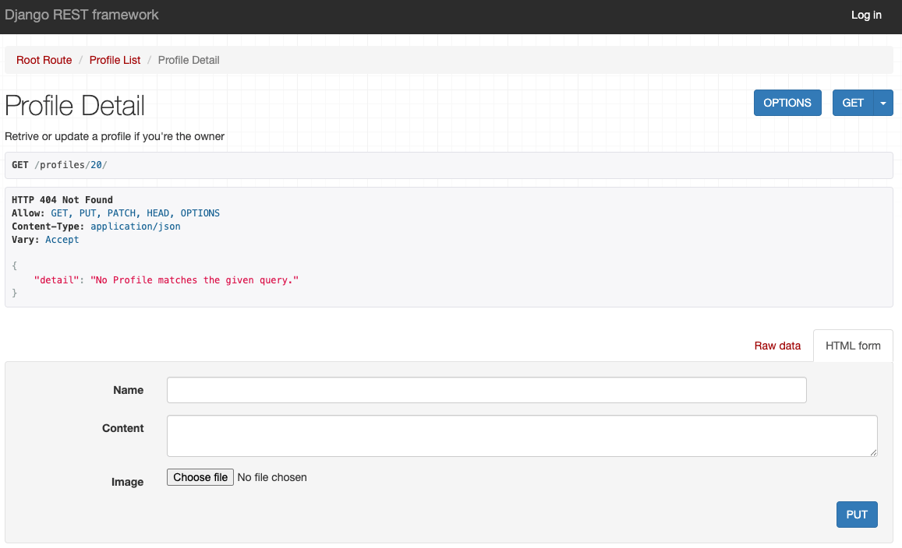
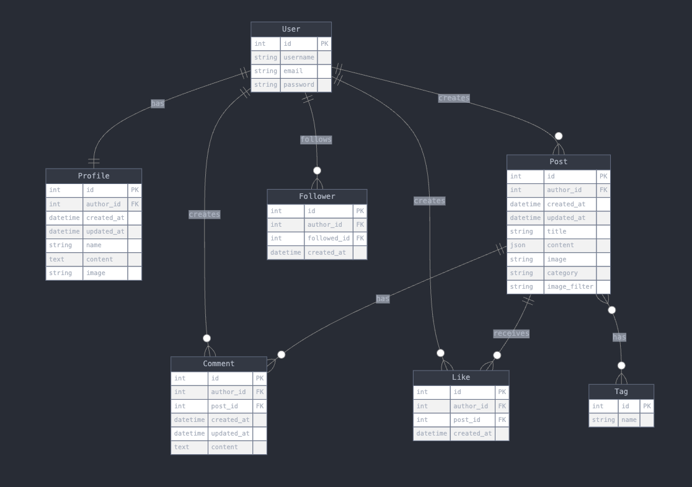

# 🍽 Foodie API Backend

[](https://github.com/Mustafa-Vienna/foodie-back/commits/main)
[](https://github.com/Mustafa-Vienna/foodie-back/commits/main)
[](https://github.com/Mustafa-Vienna/foodie-back)


## 📖 Contents <a id="contents"></a>

1. [Project Overview](#project-overview)
2. [Related Projects](#related-projects)
3. [Project Structure](#project-structure)
4. [Project Modules](#project-modules)
5. [Features](#features)
   - [Current Features](#current-features)
   - [Upcoming Features](#upcoming-features)
6. [Technologies Used](#technologies-used)
7. [Quick Start](#quick-start)
   - [Installation](#installation)
   - [Environment Configuration](#environment-configuration)
8. [Database Design](#database-design)
9. [Testing](#testing)
10. [Agile Methodology](#agile-methodology)
11. [Deployment](#deployment)
12. [Known Issues and Future Features](#known-issues-and-future-features)
13. [Credits](#credits)

---

## 🌟 Project Overview <a id="project-overview"></a>

Foodie API is a backend for a community platform where food lovers can share and discover delicious recipes. Built with Django REST Framework, it provides a robust backend for social interactions around food content.

[Go to Contents](#contents)

---

## 🌐 Related Projects <a id="related-projects"></a>

### 🧠 Backend API (Django Rest Framework + JWT)
- 🔗 GitHub: [Mustafa-Vienna/foodie-back](https://github.com/Mustafa-Vienna/foodie-back)
- 🚀 Live: [https://foodieback-0e50528a3736.herokuapp.com/](https://foodieback-0e50528a3736.herokuapp.com/)

### 💻 Frontend Application (React)
- 🔗 GitHub: [Mustafa-Vienna/foodie](https://github.com/Mustafa-Vienna/foodie)
- 🚀 Live: [https://foodiefront-bacd5250c6d8.herokuapp.com/](https://foodiefront-bacd5250c6d8.herokuapp.com/)

[Go to Contents](#contents)


## 📂 Project Structure <a id="project-structure"></a>

```
FOODIE-BACK/
│
├── manage.py
├── requirements.txt
├── README.md
├── Procfile
├── runtime.txt
├── db.sqlite3
│
├── foodie_api/
│   ├── __init__.py
│   ├── asgi.py
│   ├── permissions.py
│   ├── serializers.py
│   ├── settings.py
│   ├── urls.py
│   ├── utils.py
│   ├── views.py
│   └── wsgi.py
│
├── comments/
│   ├── __init__.py
│   ├── admin.py
│   ├── apps.py
│   ├── migrations/
│   ├── models.py
│   ├── serializers.py
│   ├── tests.py
│   ├── urls.py
│   ├── utils.py
│   └── views.py
│
├── followers/
│   ├── __init__.py
│   ├── admin.py
│   ├── apps.py
│   ├── migrations/
│   ├── models.py
│   ├── serializers.py
│   ├── tests.py
│   ├── urls.py
│   ├── utils.py
│   └── views.py
│
├── likes/
│   ├── __init__.py
│   ├── admin.py
│   ├── apps.py
│   ├── migrations/
│   ├── models.py
│   ├── serializers.py
│   ├── tests.py
│   ├── urls.py
│   ├── utils.py
│   └── views.py
│
├── posts/
│   ├── __init__.py
│   ├── admin.py
│   ├── apps.py
│   ├── migrations/
│   ├── fit_post_content.py
│   ├── models.py
│   ├── serializers.py
│   ├── tests.py
│   ├── urls.py
│   ├── utils.py
│   └── views.py
│
├── profiles/
│   ├── __init__.py
│   ├── admin.py
│   ├── apps.py
│   ├── migrations/
│   ├── models.py
│   ├── serializers.py
│   ├── tests.py
│   ├── urls.py
│   ├── utils.py
│   └── views.py
│
├── media/
│   └── images/
│       ├── tiika_burger_75fade9.webp
│       └── milk_burger.webp
│
└── .gitignore
```

[Go to Contents](#contents)

---

## 🗂 Project Modules <a id="project-modules"></a>

* 🧠 **Main Config**: `foodie_api/`
  - Core project configuration
  - API settings and main URLs
  - Permissions and serializers

* 🍽 **Posts**: `posts/`
  - Create, read, update, delete food posts
  - Content management
  - Post-related utilities

* ❤️ **Likes**: `likes/`
  - Like functionality
  - User interaction tracking

* 💬 **Comments**: `comments/`
  - Comment system
  - User discussions

* 👥 **Followers**: `followers/`
  - User follow/unfollow mechanics
  - Social connection management

* 👤 **Profiles**: `profiles/`
  - User profile management
  - Profile-related operations

[Go to Contents](#contents)


---

## 🚀 Features <a id="features"></a>

### ✅ Current Features <a id="current-features"></a>

#### 🔐 JWT-Based Authentication
- Secure login and token management with **SimpleJWT**
- Returns custom payload with user details (ID, username, profile image)
- Integrated into login/signup flow  
📸 *Proof:*  


#### 👤 User Profile Management
- Profiles automatically created on user registration
- Users can edit their name, bio, and avatar
- Avatar images handled via **Cloudinary**
- Dynamic counts for posts, followers, following  
📸 *Proof:*  


#### 🍽 Create, Update & Delete Food Posts
- Authenticated users can:
  - Create rich posts with title, intro, steps, ingredients, and images
  - Update or delete only their own posts
- Validations for fields like tags, category, and image  
📸 *Proof:*  


#### 🖼 Image Upload via Cloudinary
- Profile and post images stored using **Cloudinary**
- Fallback to a default image when none is uploaded
- Fully integrated into serializers for real-time rendering

#### ❤️ Like System for Posts
- Users can like/unlike any post
- Total likes and like status (`liked` / `not liked`) calculated per user
- Tooltip feedback and frontend counter sync  
📸 *Proof:*  


#### 💬 Comment System Under Posts
- Comment creation, listing, and user linking
- Shows author info and avatar
- Only comment owners can delete or update their comments  
📸 *Proof:*  


#### 👥 Follow/Unfollow Users
- Authenticated users can follow or unfollow others
- Profile detail view shows follow status and counts
- Prevents duplicate follows  
📸 *Proof:*  


#### 🔎 Filtering, Search & Pagination
- Full filtering and ordering for posts (e.g., `likes_count`, `comments_count`, `created_at`)
- Filter by tag or category using DjangoFilterBackend
- Paginated results for efficient browsing  
📸 *Proof:*  
  


#### 📦 Modular & RESTful API Design
- Organized by app: `profiles`, `posts`, `comments`, `likes`, `followers`
- RESTful views and URL patterns for clean endpoint usage
- Token-protected POST, PATCH, DELETE actions

#### 🚫 Error Handling Example
- Example: Attempting to access a non-existent profile  
📸 *Proof:*  


---
[Go to Contents](#contents)


### 🔜 Upcoming Features <a id="upcoming-features"></a>

#### 🔁 Like & Reply to Comments
- Allow users to like individual comments
- Introduce **comment replies** for threaded discussions
- Build hierarchical structure using parent-child relationships  
🧪 *Planned Test Cases:*  
- Verify comment reply creation by authenticated users  
- Ensure reply nesting limited to one level  
- Test like toggling on comments

#### 📝 Add New Post from Profile Page
- Create posts directly from profile page
- Reduces navigation friction  
🧪 *Planned Test Cases:*  
- Ensure form visibility only for profile owners  
- Validate post creation and redirection

#### 🌟 Popular Profiles
- Endpoint to list top profiles based on follower count, post count, engagement  
🧪 *Planned Test Cases:*  
- Rank profiles correctly  
- Ensure endpoint is paginated and filterable

#### 🔔 Real-Time Notifications (WebSockets)
- Notify users about new followers, likes, comments/replies
- Built with Django Channels + Redis backend  
🧪 *Planned Test Cases:*  
- Validate event broadcasting  
- Test fallback to polling

#### 💌 Direct Messaging (DM)
- Private chat with notifications and real-time updates via WebSockets  
🧪 *Planned Test Cases:*  
- Ensure only involved users can view/send messages  
- Rate-limit message sending

#### 📌 Save for Later / Bookmark Recipes
- Bookmark recipes and view in "Saved Posts" section  
🧪 *Planned Test Cases:*  
- Prevent duplicate bookmarks  
- Validate saved/un-saved toggle

#### 🧠 Smart Content Recommendations
- Recommend posts based on tags, categories, liked content  
🧪 *Planned Test Cases:*  
- Exclude user’s own posts  
- Fallback to trending posts if data insufficient

[Go to Contents](#contents)

---

## 🛠 Technologies Used <a id="technologies-used"></a>

### Backend Framework & API
- [](https://www.djangoproject.com)
- [](https://www.django-rest-framework.org)
- [](https://dj-rest-auth.readthedocs.io)
- [](https://django-allauth.readthedocs.io)
- [](https://github.com/jazzband/djangorestframework-simplejwt)

### Database & Storage
- [](https://www.postgresql.org)
- [](https://cloudinary.com)
- [](https://github.com/klis87/django-cloudinary-storage)
- [](https://whitenoise.readthedocs.io)

### Additional Libraries & Tools
- [](https://github.com/adamchainz/django-cors-headers)
- [](https://django-filter.readthedocs.io)
- [](https://django-extensions.readthedocs.io)
- [](https://gunicorn.org)
- [](https://python-pillow.org)

### Supporting Libraries
- [](https://pypi.org/project/asgiref/)
- [](https://pypi.org/project/certifi/)
- [](https://pypi.org/project/charset-normalizer/)
- [](https://pypi.org/project/idna/)
- [](https://pypi.org/project/oauthlib/)
- [](https://pypi.org/project/packaging/)
- [](https://pypi.org/project/psycopg2-binary/)
- [](https://pypi.org/project/PyJWT/)
- [](https://pypi.org/project/pytz/)
- [](https://pypi.org/project/requests/)
- [](https://pypi.org/project/requests-oauthlib/)
- [](https://pypi.org/project/six/)
- [](https://pypi.org/project/sqlparse/)
- [](https://pypi.org/project/typing_extensions/)
- [](https://pypi.org/project/urllib3/)

These libraries ensure efficient HTTP requests, secure data handling, and overall stability.

### Development & Deployment
- [](https://www.heroku.com)
- [](https://git-scm.com)
- [](https://github.com)
- [](https://code.visualstudio.com)

[Go to Contents](#contents)

---


## ⚡️ Quick Start <a id="quick-start"></a>

### 📥 Installation <a id="installation"></a>

1. **Clone the repository**
```bash
git clone https://github.com/Mustafa-Vienna/foodie-back.git
cd foodie-back
```

2. **Create virtual environment**
```
python -m venv venv
source venv/bin/activate  # Unix/Mac
venv\Scripts\activate     # Windows
```

3. **Install Dependencies**
```
pip install -r requirements.txt
```

4. **Set up environment variables**
- **Create `env.py` file with:**

```
import os
os.environ['SECRET_KEY'] = 'your-secret-key'
os.environ['DATABASE_URL'] = 'your-database-url'
os.environ['CLOUDINARY_URL'] = 'your-cloudinary-url'
```


5. **Run migration**
```
python manage.py migrate
```

6. **Start the development server**
```
python manage.py runserver
```
🔐 Environment Configuration <a id="environment-configuration"></a>
Variable	Description
SECRET_KEY	Django secret key
DATABASE_URL	PostgreSQL connection string
CLOUDINARY_URL	Full Cloudinary media URL
CLOUDINARY_CLOUD_NAME	Your Cloudinary cloud name
CLOUDINARY_API_KEY	Your Cloudinary API key
CLOUDINARY_API_SECRET	Your Cloudinary API secret
DEV	Set to 1 for local development
ALLOWED_HOSTS	Comma-separated list of allowed domains


| Variable                | Description                                 |
|-------------------------|---------------------------------------------|
| `SECRET_KEY`            | Django secret key                           |
| `DATABASE_URL`          | PostgreSQL connection string                |
| `CLOUDINARY_URL`        | Full Cloudinary media URL                   |
| `CLOUDINARY_CLOUD_NAME` | Your Cloudinary cloud name                  |
| `CLOUDINARY_API_KEY`    | Your Cloudinary API key                     |
| `CLOUDINARY_API_SECRET` | Your Cloudinary API secret                  |
| `DEV`                   | Set to `1` for local development            |
| `ALLOWED_HOSTS`         | Comma-separated list of allowed domains     |

[Go to Contents](#contents)

---


## 🗃️ Database Design <a id="database-design"></a>

Understanding the database relationships is crucial to how the API handles user interactions, content organization, and social features. Below is an overview of the key models and relationships used in the project.

### 🧩 Entity Relationship Diagram (ERD)

To visualize the schema, I used an **online ERD generator** based on Django models.  
📍 ERD location: `documentation/backend_validation/erd.png`



### 🔗 Relationships Overview

- **User - Profile**: One-to-One  
  Each user has exactly one profile, and each profile belongs to one user.

- **User - Post**: One-to-Many  
  A user can have many posts. Each post belongs to one user.

- **User - Comment**: One-to-Many  
  A user can write many comments. Each comment is linked to one user.

- **User - Like**: One-to-Many  
  Users can like many posts. Each like belongs to a user.

- **User - Follower**: Many-to-Many (self-referencing)  
  Users can follow other users and be followed by many.  
  Implemented through the `Follower` model.

- **Post - Comment**: One-to-Many  
  A post can have many comments. Each comment belongs to one post.

- **Post - Like**: One-to-Many  
  A post can have many likes. Each like belongs to one post.

- **Post - Tag**: Many-to-Many  
  Posts can have multiple tags. Tags can be associated with multiple posts.

### ⚙️ Notes

- Primary keys are auto-generated by Django.
- Foreign keys define model relationships.
- Constraints include:
  - Unique: `Follower(author_id, followed_id)`, `Like(author_id, post_id)`, `Tag(name)`
  - `on_delete=models.CASCADE` is used throughout for relational integrity.

[Go to Contents](#contents)

---


## 🧪 Testing <a id="testing"></a>

All functionality was manually tested using a combination of frontend interactions and backend validation. This includes form submissions, error messages, user authentication, image uploads, data validation, and proper permission handling across the application.

> **Note:**  
> Full details including test cases, screenshots, and validation results are documented in the [TESTING.md](TESTING.md) file.


[Go to Contents](#contents)

---

## 📈 Agile Methodology <a id="agile-methodology"></a>

This project followed an **Agile** approach using **GitHub Projects (Kanban Board)** for planning and task tracking. Each task was created as a GitHub Issue and assigned a priority using the **MoSCoW Method** (`Must-Have`, `Should-Have`, `Could-Have`, `Won't-Have`). Tasks moved through stages: `Backlog`, `Ready`, `In Progress`, `In Review`, and `Done`.

### 🧩 Workflow Highlights

- **Kanban Board**: [View completed user stories here](https://github.com/users/Mustafa-Vienna/projects/9/views/1) for detailed tracking of each implemented feature.

> ### 📝 Note on Agile Planning and User Stories
>
> While this project followed an Agile-inspired approach, the **user stories** and **Kanban board** were formalized near the end of the development cycle.
>
> Initially, I prioritized backend development, closely following the Code Institute's Django REST Framework tutorial to establish a robust and reliable foundation.
>
> During frontend integration, I encountered several challenges due to **modern library dependencies** and limited documentation, spending considerable time resolving compatibility issues and troubleshooting unexpected breaking changes.
>
> The original project concept evolved into the current **Foodie** platform. Given time constraints, I structured the Kanban board and developed user stories based on **actually implemented features** and comprehensive manual testing.
>
> All planned features were successfully completed and have now been moved to the `Done` column, reflecting an accurate and transparent account of the project's final state.

### 📅 Iterative Milestones

1. **Authentication & Profiles**  
   User login, registration, profile creation and management, JWT integration

2. **Posts & Interactions**  
   CRUD operations for posts, likes, comments, image handling, validation

3. **Advanced Social Features**  
   Follow system, filtering, search, popular content

[Go to Contents](#contents)

---

## 🚀 Deployment <a id="deployment"></a>

The **Foodie API** backend is deployed on **Heroku**, ensuring reliable and scalable hosting.

### 🔧 Backend Configuration Highlights

- **Hosting Platform**: [Heroku](https://www.heroku.com/)
- **Database**: PostgreSQL (configured via [`dj-database-url`](https://pypi.org/project/dj-database-url/))
- **Static File Handling**:
  - Served efficiently using [WhiteNoise](https://whitenoise.evans.io/) with compressed manifest storage:
    ```python
    STATICFILES_STORAGE = "whitenoise.storage.CompressedManifestStaticFilesStorage"
    ```
- **Media File Storage**:
  - Managed via [Cloudinary](https://cloudinary.com/):
    ```python
    DEFAULT_FILE_STORAGE = "cloudinary_storage.storage.MediaCloudinaryStorage"
    CLOUDINARY_URL is loaded from `env.py` or Heroku config vars.
    ```

### 🔐 Security & Production Settings

- **Environment Variables**: Set using `env.py` (locally) or via Heroku Config Vars.
- **HTTPS & SSL**: Enforced with production-level security:
    ```python
    SECURE_SSL_REDIRECT = True
    SECURE_HSTS_SECONDS = 31536000
    ```
- **JWT Authentication**:
  - Secure and token-based, using rotating refresh tokens.
  - Cookies are:
    - `HttpOnly`
    - `Secure`
    - `SameSite=None`
  - Access token lifetime: **30 minutes**  
  - Refresh token lifetime: **7 days**

### ⚙️ Deployment Notes

- `.env.py` is excluded via `.gitignore` to protect sensitive credentials.
- Application is served using `gunicorn` (production-grade WSGI server).
- `Procfile` and `runtime.txt` are included for Heroku compatibility.
- **CORS** is configured to allow:
  - Localhost (for development)
  - Frontend deployment on Heroku
  - Code Institute IDE domains via regex:

    ```python
    CORS_ALLOWED_ORIGIN_REGEXES = [
        r"^https:\/\/.*\.codeinstitute-ide\.net$",
    ]
    ```

[Go to Contents](#contents)


---

## ⚠️ Known Issues and Future Features <a id="known-issues-and-future-features"></a>

- **Known Issues**:  
  The original Code Institute tutorials were based on older versions of Django (3.2.4), dj-rest-auth (2.1.9), and other dependencies, relying heavily on session-based authentication. This project, however, uses significantly updated libraries, including Django 5.1.5 and dj-rest-auth 7.0.1, which introduced breaking changes and deprecated functionalities.  
  As a result, the login and authentication flow had to be restructured using JWT-based authentication, and several configurations needed to be adapted manually. Connecting the frontend to the backend initially caused confusion due to these differences, but all compatibility issues have now been resolved.  

  Currently, there are no critical backend issues. Minor UI adjustments and additional frontend integration work are still ongoing.

- **Future Features**:  
  See [Upcoming Features](#upcoming-features) for planned enhancements like real-time notifications, bookmarking, and content recommendations.

[Go to Contents](#contents)


---

## 🙌 Credits <a id="credits"></a>

- **Resources Used**:  
  A special thanks to the **Code Institute** for their comprehensive Django REST Framework materials, which were instrumental in completing this project. The tutorials provided invaluable guidance, even when working with newer libraries. I also relied heavily on the **Django** and **Django REST Framework** documentation and various **Cloudinary** tutorials to tackle compatibility issues.

- **Acknowledgements**:  
  - **Luke (Mentor)**: For his invaluable feedback and guidance throughout the project, ensuring its readiness and helping navigate various challenges.
  - **Ioan**: For his unwavering support and expertise in resolving compatibility issues with JWT and new library setups. His guidance, patience, and suggestions were crucial.
  - **Alex**: For his timely advice and practical solutions when dealing with complex issues, particularly in integrating JWT and ensuring smooth data flow between the frontend and backend. Their help was pivotal in navigating the complexities of modern web development.

Thanks to the open-source community, project mentors, and everyone who offered support during this journey.

[Go to Contents](#contents)