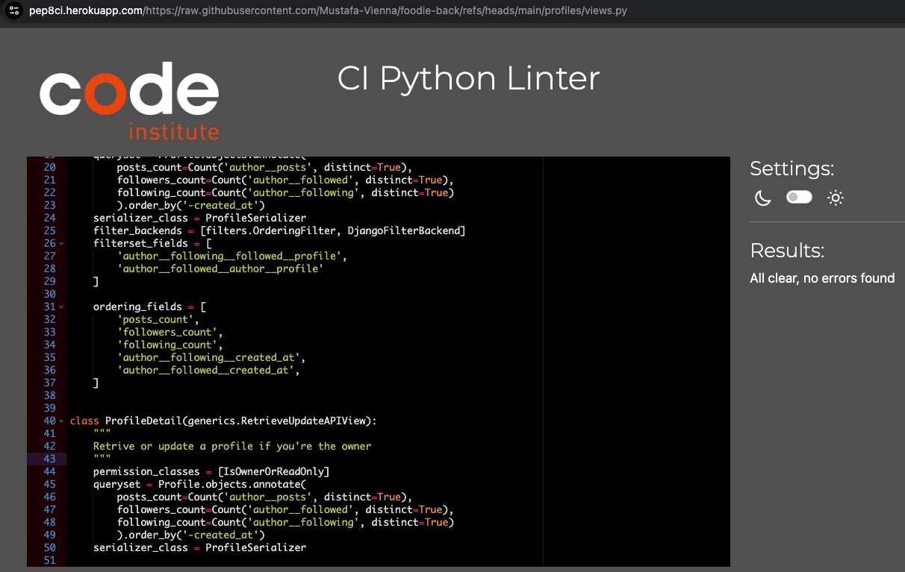

# Testing  

> [!NOTE]  
> Return back to the [README.md](README.md) file.

---

## Code Validation

### Python (PEP8)

I used the recommended [PEP8 CI Python Linter](https://pep8ci.herokuapp.com) to validate all Python files in this Django project.  
No errors or warnings were found. Below are the results with screenshots stored in `documentation/pep_validation`.

| App/Folder         | File              | Screenshot                                                   |
|--------------------|-------------------|--------------------------------------------------------------|
| `comments`         | `models.py`       |  |
|                    | `serializers.py`  |  |
|                    | `urls.py`         |  |
|                    | `views.py`        |  |
| `followers`        | `models.py`       |  |
|                    | `serializers.py`  |  |
|                    | `urls.py`         |  |
|                    | `views.py`        |  |
| `likes`            | `models.py`       |  |
|                    | `serializers.py`  |  |
|                    | `urls.py`         |  |
|                    | `views.py`        |  |
| `posts`            | `models.py`       |  |
|                    | `serializers.py`  |  |
|                    | `urls.py`         |  |
|                    | `views.py`        |  |
| `profiles`         | `models.py`       |  |
|                    | `serializers.py`  |  |
|                    | `urls.py`         |  |
|                    | `views.py`        |  |
| `foodie_api` (project folder) | `permissions.py` |  |
|                            | `serializers.py` |  |
|                            | `settings.py`    |  |
|                            | `urls.py`        |  |
|                            | `views.py`       |  |

---

> [!NOTE]  
> [Go to Testing](#top)
