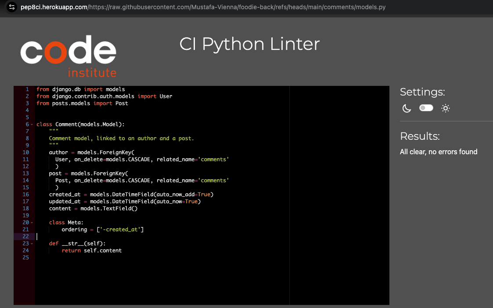
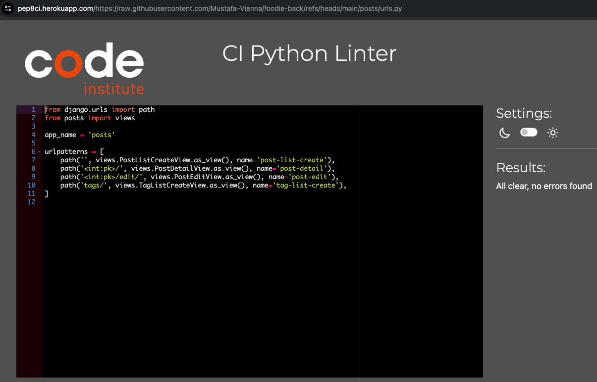
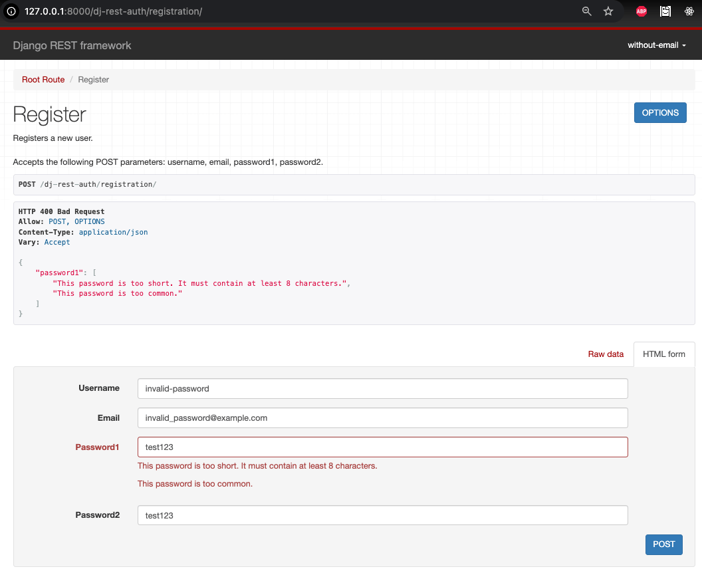

# Testing  

> [!NOTE]  
> Return back to the [README.md](README.md) file.

---

## Code Validation

### Python (PEP8)

I used the recommended [PEP8 CI Python Linter](https://pep8ci.herokuapp.com) to validate all Python files in this Django project.  
No errors or warnings were found. Below are the results with screenshots stored in `documentation/pep_validation`.

| App/Folder         | File              | Screenshot                                                   |
|--------------------|-------------------|--------------------------------------------------------------|
| `comments`         | `models.py`       |  |
|                    | `serializers.py`  |  |
|                    | `urls.py`         |  |
|                    | `views.py`        |  |
| `followers`        | `models.py`       |  |
|                    | `serializers.py`  |  |
|                    | `urls.py`         |  |
|                    | `views.py`        |  |
| `likes`            | `models.py`       |  |
|                    | `serializers.py`  |  |
|                    | `urls.py`         |  |
|                    | `views.py`        |  |
| `posts`            | `models.py`       |  |
|                    | `serializers.py`  |  |
|                    | `urls.py`         |  |
|                    | `views.py`        |  |
| `profiles`         | `models.py`       |  |
|                    | `serializers.py`  |  |
|                    | `urls.py`         |  |
|                    | `views.py`        |  |
| `foodie_api` (project folder) | `permissions.py` |  |
|                            | `serializers.py` |  |
|                            | `settings.py`    |  |
|                            | `urls.py`        |  |
|                            | `views.py`       |  |

---

## Defensive Programming

### 🧾 Registration

| Endpoint           | User Action                                       | Expected Result             | Pass/Fail | Comments                       | Screenshot |
|--------------------|---------------------------------------------------|------------------------------|-----------|--------------------------------|------------|
| `/dj-rest-auth/registration/` | Submit with missing `email` | 400 Bad Request | ✅ | Email is required |  |
| `/dj-rest-auth/registration/` | Submit with missing `username` | 400 Bad Request | ✅ | Username is required |  |
| `/dj-rest-auth/registration/` | Submit with missing `password1` | 400 Bad Request | ✅ | Password is required |  |
| `/dj-rest-auth/registration/` | Submit with invalid email format | 400 Bad Request | ✅ | Email format validation |  |
| `/dj-rest-auth/registration/` | Submit with invalid username (e.g., symbols) | 400 Bad Request | ✅ | Username format validation |  |
| `/dj-rest-auth/registration/` | Submit with short password | 400 Bad Request | ✅ | Password must be at least 8 characters |  |
| `/dj-rest-auth/registration/` | Submit with common password (e.g., "password123") | 400 Bad Request | ✅ | Common passwords are rejected |  |
| `/dj-rest-auth/registration/` | Passwords do not match (`password1` ≠ `password2`) | 400 Bad Request | ✅ | Mismatch warning shown |  |
| `/dj-rest-auth/registration/` | Submit valid form with all fields | 201 Created | ✅ | New user successfully registered |  |

---

### 🔐 Login

| Endpoint | User Action | Expected Result | Pass/Fail | Comments | Screenshot |
|----------|-------------|-----------------|-----------|----------|------------|
| `/dj-rest-auth/login/` | Submit without `password` | 400 Bad Request | ✅ | Password is required |  |
| `/dj-rest-auth/login/` | Submit without `username` or `email` | 400 Bad Request | ✅ | Username or email is required |  |
| `/dj-rest-auth/login/` | Submit with non-existent user credentials | 400 Bad Request | ✅ | No user found |  |
| `/dj-rest-auth/login/` | Submit with invalid email format | 400 Bad Request | ✅ | Email format is invalid |  |
| `/dj-rest-auth/login/` | Submit valid credentials | 200 OK | ✅ | JWT token and user returned |  |

---

### ✏️ Profile

| Endpoint           | User Action                                       | Expected Result             | Pass/Fail | Comments                       | Screenshot |
|--------------------|---------------------------------------------------|------------------------------|-----------|--------------------------------|------------|
### 👤 Profile

| Endpoint | User Action | Expected Result | Pass/Fail | Comments | Screenshot |
|----------|-------------|-----------------|-----------|----------|------------|
| `/profiles/?author=:id` | Search for existing user profile | 200 OK | ✅ | User profile details displayed correctly |  |
| `/profiles/:id/` | Upload invalid image format (e.g., PDF) | 400 Bad Request | ✅ | Only image files are accepted |  |
| `/profiles/?author=9999` | Search non-existent user | 404 Not Found or Empty result | ✅ | “No profile matches the given query.” shown |  |
| `/profiles/:id/` | Edit own profile with valid data | 200 OK | ✅ | Profile updated successfully |  |
| `/profiles/:id/` | Try editing another user's profile | 403 Forbidden or fields hidden | ✅ | Form fields hidden, edit not allowed |  |

---

### 📝 Posts

| Endpoint           | User Action                                       | Expected Result             | Pass/Fail | Comments                       | Screenshot |
|--------------------|---------------------------------------------------|------------------------------|-----------|--------------------------------|------------|
| `/posts/`          | Create post while logged out                      | 401 Unauthorized             |           | Auth required                  |  |
| `/posts/`          | Create post with missing title                    | 400 Bad Request              |           | Title is required              |  |
| `/posts/<id>/`     | Update/delete someone else’s post                 | 403 Forbidden                |           | Authenticated user check       |  |
| `/posts/<id>/`     | Post with invalid JSON content                    | 400 Bad Request              |           | Content field format checked   |  |

---

### 💬 Comments

| Endpoint           | User Action                                       | Expected Result             | Pass/Fail | Comments                       | Screenshot |
|--------------------|---------------------------------------------------|------------------------------|-----------|--------------------------------|------------|
| `/comments/`       | Submit empty comment                              | 400 Bad Request              |           | Text required                  |  |
| `/comments/`       | Comment on non-existent post                      | 404 Not Found                |           | Invalid post ID handled        |  |
| `/comments/<id>/`  | Try to delete another user’s comment              | 403 Forbidden                |           | Ownership required             |  |

---

### ❤️ Likes

| Endpoint           | User Action                                       | Expected Result             | Pass/Fail | Comments                       | Screenshot |
|--------------------|---------------------------------------------------|------------------------------|-----------|--------------------------------|------------|
| `/likes/`          | Like post twice                                   | 400 Bad Request or 204 OK    |           | Uniqueness constraint          |  |
| `/likes/`          | Like a deleted post                               | 404 Not Found                |           | Post existence check           |  |

---

### 🔁 Follows

| Endpoint           | User Action                                       | Expected Result             | Pass/Fail | Comments                       | Screenshot |
|--------------------|---------------------------------------------------|------------------------------|-----------|--------------------------------|------------|
| `/followers/`      | Follow yourself                                   | 400 Bad Request              |           | Prevent self-follow            |  |
| `/followers/`      | Follow same user twice                            | 400 Bad Request              |           | Unique constraint applied      |  |

---

### ⚠️ Error Handling & Data Validation

| Area               | User Action                                       | Expected Result             | Pass/Fail | Comments                       | Screenshot |
|--------------------|---------------------------------------------------|------------------------------|-----------|--------------------------------|------------|
| Any POST endpoint  | Send malformed JSON                               | 400 Bad Request              |           | JSON parsing handled           |  |
| Any endpoint       | Submit wrong data types (e.g. string for int)     | 400 Bad Request              |           | Type validation enforced       |  |
| ForeignKey fields  | Use non-existent related object IDs               | 404 Not Found                |           | Foreign key integrity checked  |  |
| Cloudinary uploads | No cloud_name config                              | 500 Server Error             |           | Error shown for bad setup      |  |

---

You can paste this directly into your `TESTING.md` and begin filling in the results as you test!

Want me to generate a downloadable `.md` file or add this to your existing `TESTING.md` now?

> [!NOTE]  
> [Go to Testing](#top)
